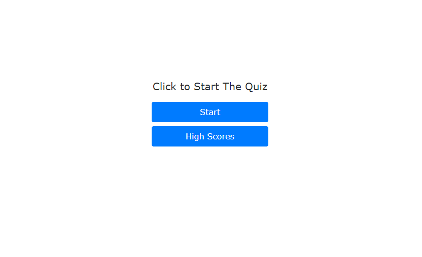
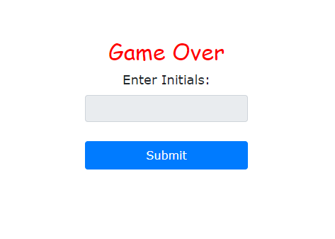
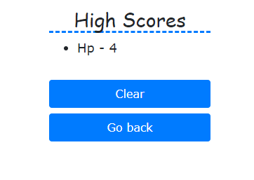

# Quiz
*Quick Links*
- [Description](#Description)
- [Usage](#Usage)
- [Authors](#Authors)
- [Deployed App](#AppLink)
- [Start Menu Visual](#Visual1)
- [Questions Visual](#Visual2)
- [Save Data Visual](#Visual3)
- [Leadboard Visual](#Visual4)

## Description
Simple quiz that anyone can take about myself.

## Usage
To have fun and take a quiz  
Features a local saved leadboard 
## Authors
Henry Parrish

## AppLink
[App Link](https://henryp23.github.io/CodeQuiz/)

## Visual1

## Visual2

## Visual3

## Visual4

